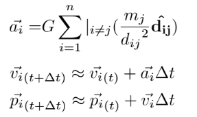

# Physics Simulation REST-API Service

## Description

REST API service exposing endpoints to manage and run gravitational physics simulations.

Simulation results are determined by the mass, initial position and velocity of the celestial objects that make up its data set.

The simulation itself runs for an amount of simulated time defined by the simulation entity (simulation.duration), updating position, velocity and acceleration vectors of the associated celestial objects every interval of time (simulation.delta_t). Celestial object positions are persisted after a given amount of updates (simulation.writing_rate).

Uses Newton's law of universal gravitation for its update algorithm.



## Author

Alexis Chrétien

## Dependencies

* [MySQL](https://dev.mysql.com/downloads/installer/)
* [GnuPlot](http://www.gnuplot.info/)

## Utilisation

```
$ go run .
```

## Features
* [ ] Rest Api
    * [X] GET /simulations
        * returns the information of all simulation instances
    * [X] GET /simulations/{id}
        * returns the information of simulation instance {id}
    * [X] GET /simulations/{id}/nested
        * returns the information of simulation instance {id} alongside its corresponding child entities (celestial objects, position history (calculated only after running the simulation))
    * [X] GET /simulations/{id}/celestialobjects
        * returns the information of simulation {id}'s celestial objects
    * [X] GET /simulations/{id}/graph
        * runs simulation {id}, returns a png trace of its celestial objects' spatial evolution
    * [ ] POST /simulations
        * creates a new simulation
    * [ ] PATCH /simulations/{id}
        * modifies simulation {id}
    * [ ] DELETE /simulations/{id}
        * deletes simulation {id}
    * [ ] POST /simulations/{id}/celestialobjects
        * creates a new celestial object for simulation {id}
    * [ ] PATCH /simulations/{sId}/celestialobjects/{cId}
        * modifies celestial object {cId} of simulation {sId}
    * [ ] DELETE /simulations/{sId}/celestialobjects/{cId}
        * deletes celestial object {cId} of simulation {sId}